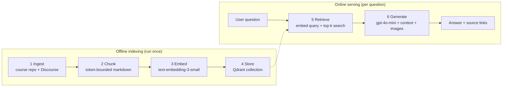

# TDS Virtual TA - a RAG pipeline


A **Retrieval-Augmented Generation (RAG)** teaching assistant for the IIT Madras **Tools in Data Science (TDS)** course. It answers student questions using the official course notes and Discourse forum threads, and returns the source links it used.

```json
POST /api   {"question": "Should I use Docker or Podman for this course?"}

{
  "answer": "Podman is recommended, but Docker is acceptable ...",
  "links": [{"url": "https://tds.s-anand.net/#/docker", "text": "..."}]
}
```

---

## How it works



| # | RAG step | Folder / module | Output |
|---|----------|-----------------|--------|
| 1 | **Ingestion** - collect raw knowledge | `tds_rag/ingestion/` | `data/raw/` |
| 2 | **Chunking** - split into retrievable pieces | `tds_rag/chunking/` | `data/processed/chunks.json` |
| 3 | **Embedding** - text to vectors | `tds_rag/embedding/` | `data/embeddings/vectors.json` |
| 4 | **Storage** - index in the vector DB | `tds_rag/storage/` | Qdrant collection `tds_kb` |
| 5 | **Retrieval** - find relevant context | `tds_rag/retrieval/` | context, images, links |
| 6 | **Generation** - grounded LLM answer | `tds_rag/generation/` | final answer |
| 7 | **Evaluation** - regression-test answers | `evaluation/` | promptfoo report |

## Project structure

```
tds-virtual-ta-rag/
├── tds_rag/                     # the RAG package, one sub-package per step
│   ├── config.py                # env vars, paths, model names, tunables
│   ├── ingestion/               # STEP 1
│   │   ├── course_scraper.py    #   clone course GitHub repo
│   │   └── discourse_scraper.py #   scrape Discourse threads (+ images)
│   ├── chunking/                # STEP 2
│   │   └── chunker.py           #   paragraph-aware, token-limited chunks
│   ├── embedding/               # STEP 3
│   │   ├── openai_embeddings.py #   embeddings API client (sync + async)
│   │   └── embedder.py          #   batch-embed chunks & posts
│   ├── storage/                 # STEP 4
│   │   └── qdrant_uploader.py   #   create collection + upsert vectors
│   ├── retrieval/               # STEP 5
│   │   └── retriever.py         #   embed query, top-k search, build context
│   └── generation/              # STEP 6
│       └── generator.py         #   prompt + chat completion
├── api/main.py                  # FastAPI app (Vercel entrypoint)
├── evaluation/promptfoo.yaml    # STEP 7 - answer-quality tests
├── tests/                       # unit tests (chunker, retriever)
├── data/                        # raw / processed / embeddings (git-ignored)
├── .github/workflows/ci.yml     # runs tests on every push
├── .env.example                 # copy to .env
├── Makefile                     # one command per step
├── requirements.txt             # runtime deps (API)
├── requirements-pipeline.txt    # + scraping / chunking / test deps
└── vercel.json
```

## Quick start

```bash
git clone https://github.com/<your-username>/tds-virtual-ta-rag.git
cd tds-virtual-ta-rag
python -m venv .venv && source .venv/bin/activate
make install-pipeline
cp .env.example .env            # then fill in your keys
```

### Configuration

| Variable | Needed by | Description |
|----------|-----------|-------------|
| `OPENAI_API_KEY` | embed, API | AIPipe or OpenAI key (`AIPIPE_TOKEN` still accepted as an alias) |
| `OPENAI_BASE_URL` | embed, API | default `https://aipipe.org/openai/v1` |
| `QDRANT_URL`, `QDRANT_API_KEY` | upload, API | Qdrant Cloud cluster |
| `QDRANT_COLLECTION` | upload, API | default `tds_kb` |
| `DISCOURSE_SESSION_COOKIE`, `DISCOURSE_T_COOKIE` | Discourse scraper | your `_forum_session` and `_t` cookies (DevTools, Application, Cookies) |
| `EMBEDDING_MODEL`, `CHAT_MODEL`, `TOP_K`, `CHUNK_TOKEN_LIMIT` | optional | tunables, see `.env.example` |

## The RAG steps

### Step 1 - Ingestion
```bash
make scrape-course       # clones sanand0/tools-in-data-science-public into data/raw/course_repo
make scrape-discourse    # threads from 2025-01-01 to 2025-04-14 into data/raw/discourse/tds_threads.json
python -m tds_rag.ingestion.discourse_scraper --start 2025-02-01 --end 2025-03-01   # custom window
```
Each Discourse post keeps its type (`question`/`answer`/`follow-up`), author, URL and any inline images (base64) so answers can cite and reason over screenshots.

### Step 2 - Chunking
```bash
make chunk               # -> data/processed/chunks.json
```
Markdown is split on paragraph boundaries and packed up to `CHUNK_TOKEN_LIMIT` tokens (default 4096, measured with `tiktoken`). Every chunk carries an `id` (`file.md#n`) and the public course URL used as its citation link.

### Step 3 - Embedding
```bash
make embed               # -> data/embeddings/vectors.json
```
Course chunks and Discourse posts are embedded with `text-embedding-3-small` (1536-d) in batches; a failed batch is retried item by item so one bad text does not lose the rest.

### Step 4 - Storage (Qdrant)
```bash
make upload
```
Creates the collection if it does not exist (1536-d, cosine) and upserts points in small batches. The payload keeps the text, source type, URL/post URL, and images.

### Step 5 & 6 - Retrieval and Generation
```bash
make serve               # http://localhost:8000
curl -X POST localhost:8000/api -H 'Content-Type: application/json' \
     -d '{"question": "When is GA4 due?"}'
```
`retriever.py` embeds the question and fetches the top-`TOP_K` (default 7) nearest chunks; it builds the context string, collects thread images, and produces source links. `generator.py` sends context, question and optional user image (`"image": "<base64>"`) to `gpt-4o-mini` with the TA system prompt.

### Step 7 - Evaluation
```bash
npm install -g promptfoo
make serve &             # API must be running
make eval
```
`evaluation/promptfoo.yaml` checks the JSON schema (`answer`, `links`), LLM-rubric quality, and that expected source links are returned.

## Deploy to Vercel
1. Push to GitHub and import the repo at [vercel.com](https://vercel.com).
2. Add environment variables: `OPENAI_API_KEY`, `OPENAI_BASE_URL`, `QDRANT_URL`, `QDRANT_API_KEY`, `QDRANT_COLLECTION`.
3. Deploy. The API is served at `https://<project>.vercel.app/api`.

Only `requirements.txt` (runtime) is installed on Vercel, so scraping libraries never bloat the function.

## Tests
```bash
make test
```

## Known limitations / roadmap
- [ ] Restrict CORS (`api/main.py`) to your frontend origin before public launch.
- [ ] Discourse images are stored base64 inside vector payloads (large); move to object storage and store URLs.
- [ ] Very long forum posts are embedded whole - add chunking for them too.
- [ ] Add hybrid (BM25 + vector) search and a re-ranker.
- [ ] Incremental indexing instead of full re-embed.

## Suggested GitHub topics
`rag` `retrieval-augmented-generation` `llm` `fastapi` `qdrant` `vector-database` `embeddings` `openai` `chatbot` `teaching-assistant` `web-scraping` `promptfoo` `vercel` `python` `iitm` `nlp`

```bash
gh repo edit --add-topic rag,retrieval-augmented-generation,llm,fastapi,qdrant,vector-database,embeddings,openai,chatbot,python
git tag -a v1.0.0 -m "Restructured RAG pipeline" && git push --tags
```

## Acknowledgements
Course content: [sanand0/tools-in-data-science-public](https://github.com/sanand0/tools-in-data-science-public) (S. Anand). Forum data: IITM Online Degree Discourse. Please respect their terms; do not commit scraped data or cookies.

## License
MIT - see [LICENSE](LICENSE).
